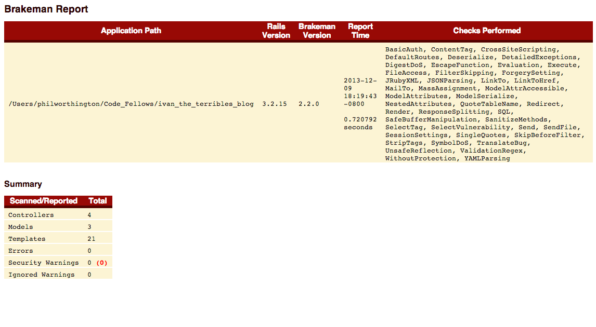

# Ivan_the_terribles_blog


By [Phil Worthington](https://github.com/philworthington).


## Description
**Ivan_the_terribles_blog** uses the Brakeman gem to identify security risks within the application, providing the location and type of security risk to guide in the risk's resolution.

All high risk errors in this app have been resolved as pictured below.


## Usage

XSS:
```
http://localhost:3000/posts?utf8=%E2%9C%93&search=archive&status=foo=%22bar%22%3E%3Cscript%3Ealert%28%22p0wned!!!%22%29%3C/script%3E%3Cp%20data-foo
```

SQL Injection:

```
foo%'); INSERT INTO posts (id,title,body,created_at,updated_at) VALUES (99,'hacked','hacked alright','2013-07-18','2013-07-18'); SELECT "posts".* FROM "posts" WHERE (title like '%anything
```


## Information

Screenshot below:




## License

MIT: http://philworthington.mit-license.org
